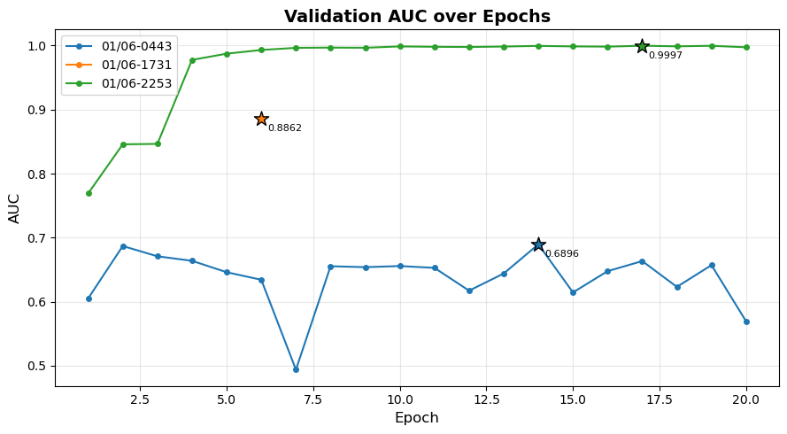
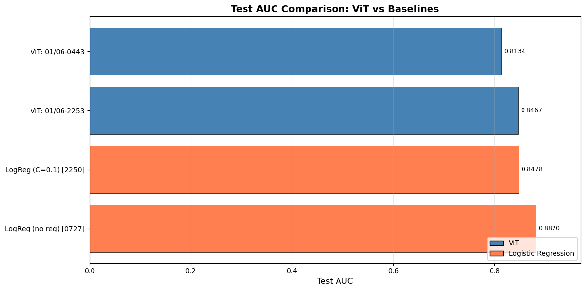
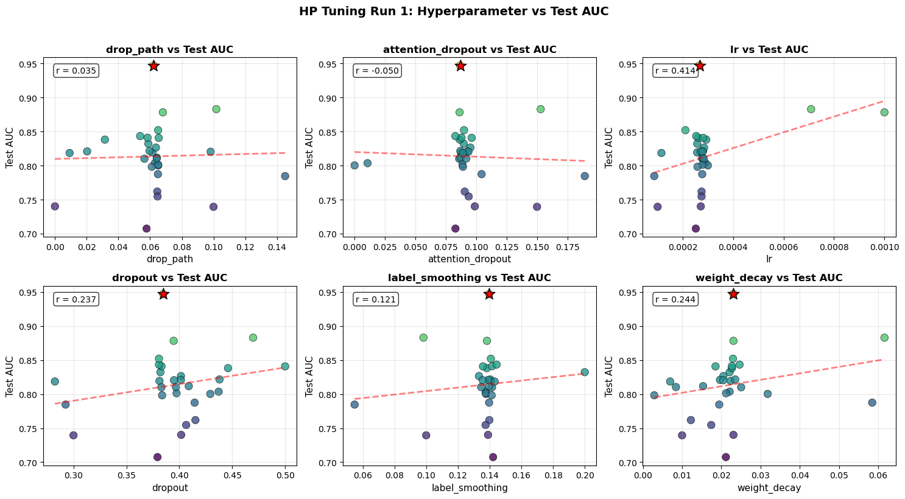

# Temporal 3D Neural ViT

End-to-end pipeline for classifying WT vs FMR1 knockout mice from multi-trial LFP (Local Field Potential) spectrogram sequences using a Temporal 3D Vision Transformer. The model represents each sample as a 3D token volume (`trial x frequency x time`) to capture cross-trial dynamics that single-trial models can miss.

## Overview

The pipeline pulls raw LFP traces from BigQuery, exports session-stratified splits to GCS, preprocesses each trial into normalized spectrogram parquets, and trains Temporal ViT models on Vertex AI with experiment tracking and checkpointing.

## Pipeline Snapshot

- **Source data**: BigQuery tables of per-trial LFP traces.
- **Export**: Session-stratified train/val/test splits written to GCS.
- **Preprocessing**: Spectrogram computation, train-set normalization, parquet emission.
- **Training**: Temporal 3D ViT with configurable depth/width/regularization.
- **Tracking**: Metrics in Vertex Experiments + TensorBoard, checkpoints in GCS.
- **Evaluation**: Aggregation and comparisons in `evals/`.

## Repo Highlights

- `temporal_vit/models/`: Temporal 3D ViT architecture and configs.
- `temporal_vit/data/`: preprocessing, dataloaders, and data audit utilities.
- `temporal_vit/training/`: training loop, config, and experiment logging.
- `temporal_vit/cloud/`: BigQuery/GCS export helpers.
- `baselines/`: logistic regression + XGBoost baselines on sequence features.
- `evals/`: run aggregation, integrity checks, and notebooks.
- `notebooks/eda.ipynb`: EDA and data quality checks.

## Results (from `evals/`)

Source artifacts:
- `evals/baseline_results.json`
- `evals/run_details.json`
- `evals/hptune_run_1_details.json`
- `evals/hptune_run_2_details.json`
- `evals/no_class_weights.csv`
- `evals/class_weighted_incr_dropout.csv`

### Baselines

| Model | Val Acc | Val AUC | Test Acc | Test AUC | Total Time (s) |
| --- | ---: | ---: | ---: | ---: | ---: |
| LogReg (no reg) [0727] | 0.7930 | 0.9953 | 0.5082 | 0.8820 | 329.4400 |
| LogReg (C=0.1) [2250] | 0.8791 | 0.9973 | 0.5294 | 0.8478 | 367.5100 |

### Core Temporal ViT Runs

| Run ID | Best Val AUC (step) | Final Test Acc | Final Test AUC |
| --- | --- | ---: | ---: |
| temporal-vit-20260106-044352 | 0.6896 (14) | 0.8417 | 0.8134 |
| temporal-vit-20260106-173131 | 0.8862 (6) | N/A | N/A |
| temporal-vit-20260106-225305 | 0.9997 (17) | 0.8244 | 0.8467 |

### HP Tune Sweeps

| Sweep | Best-by-Test-AUC Run | Best Val AUC | Final Test Acc | Final Test AUC |
| --- | --- | ---: | ---: | ---: |
| Run 1 (`evals/hptune_run_1_details.json`) | temporal-vit-20260108-041936 | 0.9994 | 0.7718 | 0.9467 |
| Run 2 (`evals/hptune_run_2_details.json`) | temporal-vit-20260109-010526 | 0.9990 | 0.7634 | 0.8854 |

Run 1 best-run parameter snapshot is stored in `evals/evals/hptune_params_8-041936.json`.

### CSV Ablations

| Setting | Test Loss | Test Acc | Test AUC |
| --- | ---: | ---: | ---: |
| no_class_weights (`evals/no_class_weights.csv`) | 0.2480 | 0.9008 | 0.9612 |
| class_weighted_incr_dropout (`evals/class_weighted_incr_dropout.csv`) | 0.4522 | 0.7203 | 0.7941 |

Note: these files represent different experiment batches/configurations, so "best" values should be interpreted within each source grouping.

## Performance Plots

**Validation AUC Across Training**



Per-run validation AUC trajectories show how quickly stronger runs separate during training.  
Source: `evals/evals.ipynb` (Plot 2).

**Test AUC Comparison (Temporal ViT vs Baselines)**



Temporal ViT runs generally outperform logistic baseline test AUC in the current run set.  
Source: `evals/evals.ipynb` (Plot 4).

**HP Tuning Hyperparameters vs Test AUC (Run 1 + Run 2)**



This view summarizes hyperparameter sensitivity across both HP-tuning sweeps and helps identify stable high-performing regions.  
Source: `evals/evals.ipynb` (multi-run HP scatter plot).

## Key Takeaways

- Temporal ViT runs substantially improve test accuracy over logistic baselines.
- The strongest HP-tuned test AUC in the current artifacts is `0.9467` from `temporal-vit-20260108-041936` (Run 1 sweep).
- In the two CSV ablations, `no_class_weights` shows the strongest held-out test AUC.

## Reproducing Evaluation Summaries

```bash
python evals/collect_baseline_results.py
python evals/collect_run_details.py
python evals/collect_hptune_details.py
```
